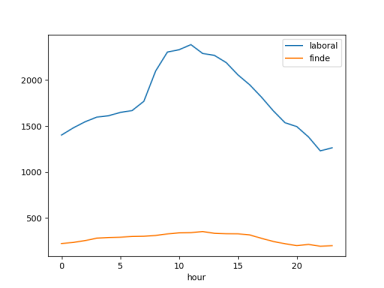

# Procesamiento de los datos

## Obtención de los datos

1. Descargamos de los datos desde la web:

    ```
    curl -s "https://opendata.emtmadrid.es/Datos-estaticos/Datos-generales-(1)"\
        | grep -o '/getattachment/[^"]*'\
        | awk -v u="$baseurl" '{ print u$1 }'\
        | xargs -n 1 -P 8 axel -q
    ```

2. Descomprimimos de los datos en formato zip y rar (`descomprimir_datos`

    ```
    ls ./*.zip | xargs -n 1 -P 8 unzip
    ls ./*.rar | xargs -n 1 -P 8 unrar e
    ```

3. Renombramos los ficheros con el mismo formato, desde un navegador de ficheros.
4. Importamos los ficheros *json* a *hdfs*, ajustando los tamaños de los bloques
   según los tamaños de los ficheros, de modo que cada fichero se divide en al
   menos 20 bloques y de este modo se aprovecha el paralelismo del cluster. De
   esta parte hemos perdido el código (borramos el fichero `.bash_history` del
   cluster).

## Cargando los datos en Spark: `./bicimad/data.py`

Además hemos implementado en python dos clases, `Movements` y `Stations`, que
heredan a la clase `Data` y encapsulan los *dataframes* de *Spark* de los
correspondientes tipos de datos.

La clase `DataLoader` sirve para cargar los *json*s e inicializar las clases
hijas de `Data`. Si el código se ejecuta en una máquina donde está el binario de
*hdfs* se cargarán los ficheros desde *hdfs* y en caso contrario desde la
carpeta `./samples`. Mediante los métodos `get_files` y `get_data` se pueden
seleccionar los ficheros correspondientes a un rango de meses. La función
`get_files` devuelve información de los ficheros y `get_data` devuelve objetos
de tipo `Movements` o `Stations`.

## Resúmenes: `./bicimad/sampler.py`

La clase `Sampler` encapsula las funciones utilizadas para crear resúmenes
(samples) de los datos originales. Hemos ejecutado estas funciones en el clúster
y descargado los resúmenes a la carpeta `samples`.


# Análisis de componentes principales

Hemos intentado realizar una reducción de las variables mediante un análisis de
componentes principales para visualizar mejor los datos e identificar posibles
clústers.

## Objetivo

Queríamos reproducir el análisis de un artículo que estudia el tráfico de las
bicicletas en un puente de Seattle, esperando obtener una clusterización
algo similar:


## Referencias
1. [Analís de componentes principales - Wikipedia](https://ast.wikipedia.org/wiki/Anal%C3%ADs_de_componentes_principales)
2. [Learning Seattle's Work Habits from Bicycle Counts](https://jakevdp.github.io/blog/2015/07/23/learning-seattles-work-habits-from-bicycle-counts/)
3. [Análisis de componentes principales](https://en.wikipedia.org/wiki/Principal_component_analysis)

\newpage

## Nuestro intento

### Plaza Juan Pujol:

`python -m bicimad pipeline stations_pca --start 202007 --end 202012 --args 63`


### Calle San Germán

`python -m bicimad pipeline stations_pca --start 202007 --end 202012 --args 139`


# Análisis por días laborables / fines de semana

### Plaza Juan Pujol:

`python -m bicimad pipeline stations --start 202007 --end 202012 --args 63`



### Calle San Germán

`python -m bicimad pipeline stations --start 202007 --end 202012 --args 139`


